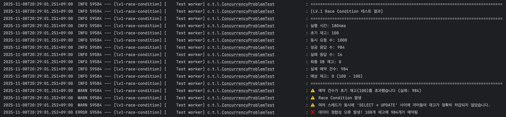
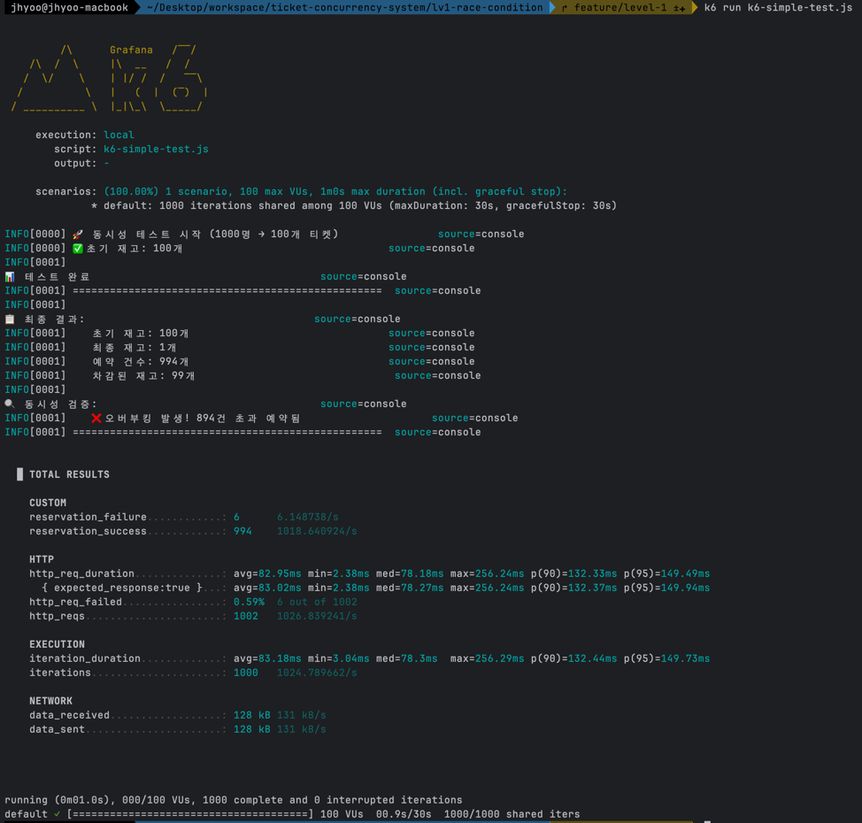

# LV.1 - Race Condition 문제 재현

## 📌 목표
동시성 문제(Race Condition)를 재현하고 증명하는 단계입니다.

## 🔍 문제 정의

### 시나리오
- **100개의 티켓 재고**가 있습니다.
- **1000명의 사용자**가 동시에 예매를 시도합니다.
- 락(Lock)이 없는 상태에서 어떤 문제가 발생하는지 확인합니다.

### Race Condition이란?
여러 스레드가 동시에 공유 자원(재고)에 접근할 때, 실행 순서에 따라 결과가 달라지는 문제입니다.

```
스레드 A: SELECT stock FROM tickets WHERE id = 1;  (stock = 100)
스레드 B: SELECT stock FROM tickets WHERE id = 1;  (stock = 100) ← 동시에 조회!
스레드 A: UPDATE tickets SET stock = 99 WHERE id = 1;
스레드 B: UPDATE tickets SET stock = 99 WHERE id = 1;  ← 99로 덮어씀!

결과: 2번 차감되어야 하는데 1번만 차감됨 (100 → 99)
```

## 💻 구현 내용

### 1. 엔티티 (Domain)
- `Ticket`: 티켓 정보와 재고를 관리
- `Reservation`: 예약 정보를 저장

### 2. 서비스 로직
```java
@Transactional
public void reserveTicket(Long ticketId, String userId) {
    // 1. SELECT - 티켓 조회
    Ticket ticket = ticketRepository.findById(ticketId)
            .orElseThrow(() -> new IllegalArgumentException("티켓을 찾을 수 없습니다."));

    // 2. 재고 확인
    if (!ticket.hasStock()) {
        throw new IllegalStateException("재고가 부족합니다.");
    }

    // ⚠️ 여기서 다른 스레드가 끼어들 수 있음!
    Thread.sleep(10); // 문제를 더 명확히 보기 위한 지연

    // 3. UPDATE - 재고 차감
    ticket.decreaseStock();
    ticketRepository.save(ticket);

    // 4. 예약 정보 저장
    Reservation reservation = new Reservation(ticketId, userId);
    reservationRepository.save(reservation);
}
```

### 문제점
- `SELECT`와 `UPDATE` 사이에 **시간차**(Time-of-check to time-of-use)가 존재
- 여러 스레드가 동시에 이 시간차에 끼어들면 재고가 정확히 차감되지 않음
- **데이터 정합성 붕괴**

### 결과

### 테스트 코드


### k6 부하 테스트 결과


## 🎯 핵심 배움

1. **@Transactional은 동시성 문제를 해결하지 못한다**
   - 트랜잭션은 ACID를 보장하지만, 여러 트랜잭션이 동시에 실행되는 것을 막지는 못함
   
2. **SELECT와 UPDATE 사이의 시간차가 문제**
   - 이 시간차에 다른 스레드가 끼어들 수 있음
   
3. **데이터 정합성이 깨진다**
   - 100개 재고에 900개 이상이 예약되는 불가능한 상황 발생

## 🚀 다음 단계 (LV.2)

이 문제를 해결하기 위해 **DB Lock**을 적용합니다.
- Pessimistic Lock (비관적 락): `SELECT ... FOR UPDATE`
- Optimistic Lock (낙관적 락): `@Version` 사용
