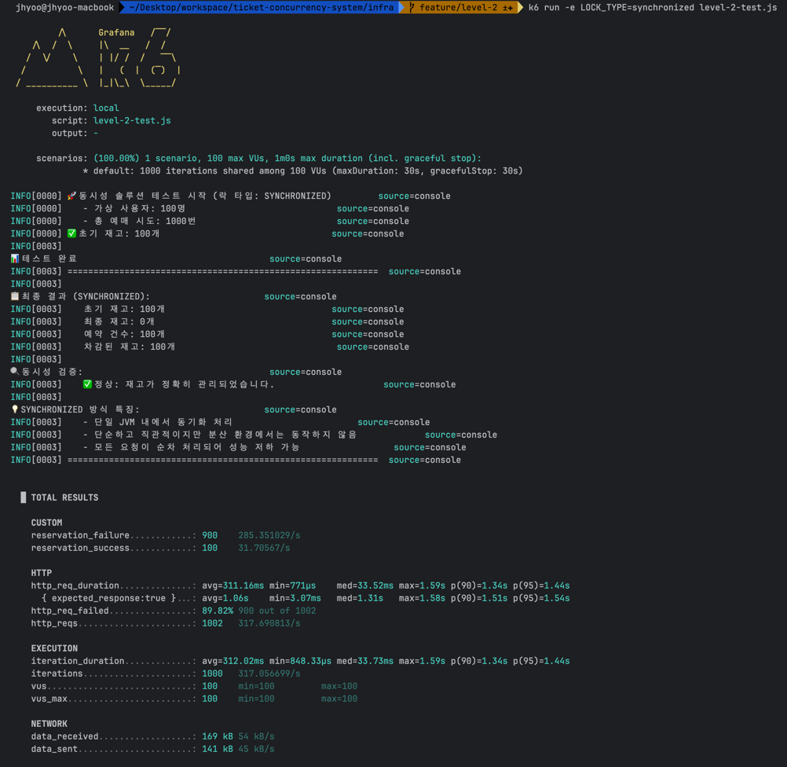
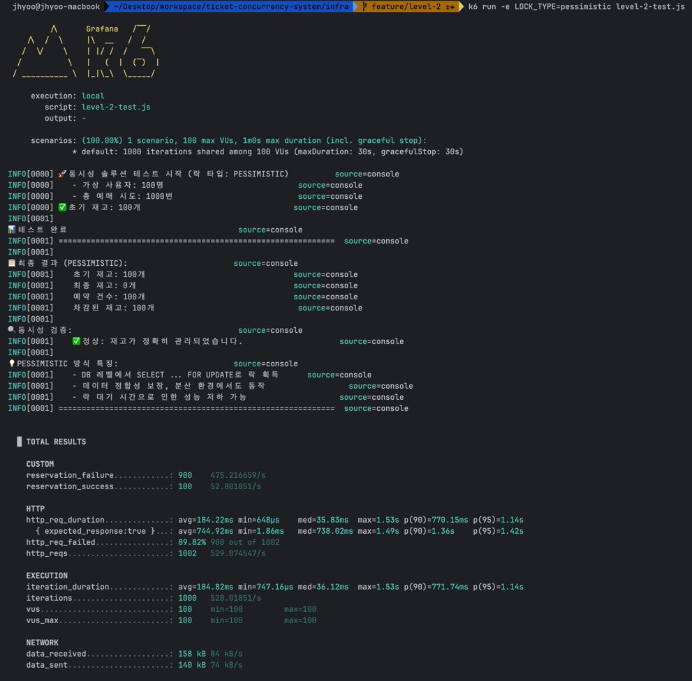
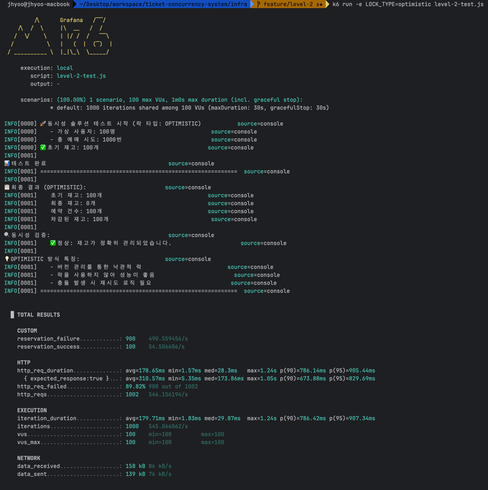

# LV.2 DB Lock을 이용한 동시성 제어

## 개요

LV.1에서 발견한 Race Condition 문제를 해결하기 위해 3가지 방식을 구현하고 비교합니다.

1. **Synchronized 키워드** - 애플리케이션 레벨 동기화
2. **Pessimistic Lock (비관적 락)** - DB 레벨 락 (SELECT ... FOR UPDATE)
3. **Optimistic Lock (낙관적 락)** - 버전 기반 충돌 감지

<br>

## 핵심 개념

### 1. Synchronized (동기화)

```java
public synchronized void reserveTicket(Long ticketId, String userId) {
    // 한 번에 하나의 스레드만 이 메서드를 실행할 수 있음
}
```

**장점:**
- 구현이 간단하고 직관적
- 단일 JVM 내에서는 동시성 문제 완벽 해결

**단점:**
- 단일 서버(JVM) 환경에서만 동작
- 멀티 인스턴스(분산 환경)에서는 동작하지 않음
- 모든 요청이 순차적으로 처리되어 성능 저하

<br>

### 2. Pessimistic Lock (비관적 락)

```java
@Lock(LockModeType.PESSIMISTIC_WRITE)
@Query("SELECT t FROM Ticket t WHERE t.id = :id")
Optional<Ticket> findByIdWithPessimisticLock(@Param("id") Long id);
```

**실행 쿼리:**
```sql
SELECT * FROM tickets WHERE id = 1 FOR UPDATE;
```

**장점:**
- 데이터 정합성 보장
- 멀티 인스턴스 환경에서도 동작
- 충돌이 많이 발생할 것으로 예상되는 경우 유리

**단점:**
- 락 대기 시간으로 인한 성능 저하 (병목)
- 데드락 발생 가능성
- DB에 부하 증가

<br>

### 3. Optimistic Lock (낙관적 락)

```java
@Entity
public class Ticket {
    @Id
    private Long id;
    
    @Version  // 버전 관리
    private Long version;
    
    // ...
}
```

**동작 원리:**
1. 데이터를 읽을 때 버전 정보도 함께 읽음
2. 데이터를 수정할 때 버전을 확인
3. 버전이 다르면 충돌로 판단하고 예외 발생 (`ObjectOptimisticLockingFailureException`)
4. 예외 발생 시 재시도 로직 필요

**장점:**
- 락을 사용하지 않아 성능이 좋음
- 충돌이 적을 것으로 예상되는 경우 유리
- 멀티 인스턴스 환경에서도 동작

**단점:**
- 충돌 발생 시 재시도 로직 필요
- 충돌이 많은 경우 오히려 성능 저하
- 사용자에게 실패 경험 제공

<br>

## 테스트 결과

### 테스트 조건
- 초기 재고: 100개
- 동시 요청: 1000명
- 예상 결과: 100명만 성공, 900명 실패

### Synchronized


### Pessimistic Lock


### Optimistic Lock


<br>

## 주요 학습 내용

### 1. Synchronized의 한계
- JVM 메모리 내에서만 동작하므로, 서버가 여러 대인 경우 소용없음
- 예: 서버 A와 서버 B가 동시에 같은 티켓을 처리하면 여전히 Race Condition 발생

### 2. Pessimistic Lock vs Optimistic Lock
- **비관적 락**: "충돌이 많이 발생할 것이다" → 미리 락을 걸어둠
- **낙관적 락**: "충돌이 적을 것이다" → 일단 진행하고 충돌 시 재시도

### 3. 트레이드오프 (Trade-off)
- **데이터 정합성 vs 성능**: 락이 강할수록 정합성은 보장되지만 성능은 떨어짐
- **성능 비교**: Synchronized < Pessimistic Lock < Optimistic Lock
- **구현 복잡도**: Synchronized < Pessimistic Lock < Optimistic Lock (재시도 로직 포함)

<br>

## 한계점

### 1. 성능 병목
- 모든 방식에서 결국 '순차 처리'가 발생
- 1000명이 동시에 요청해도 100명의 요청을 순차적으로 처리해야 함
- 대용량 트래픽에서는 타임아웃 발생 가능

### 2. Optimistic Lock의 재시도 폭증
- 동시 요청이 많을 경우 재시도가 폭증하여 오히려 성능 저하
- 재시도 횟수 제한 필요

### 3. DB 부하
- Pessimistic Lock은 DB 커넥션을 오래 점유
- 대용량 트래픽 시 DB 커넥션 풀 고갈 가능

<br>

## 다음 단계 (LV.3)

DB Lock의 한계를 극복하기 위해 **Redis**를 도입합니다.

- **재고 관리를 Redis로 분리**하여 DB 부하 감소
- **Atomic 연산**으로 락 없이 동시성 제어
- 성능 대폭 향상 예상

<br>

## 참고 자료

- [Pessimistic vs Optimistic Locking](https://www.baeldung.com/jpa-pessimistic-locking)
- [Java Synchronized Keyword](https://docs.oracle.com/javase/tutorial/essential/concurrency/sync.html)
