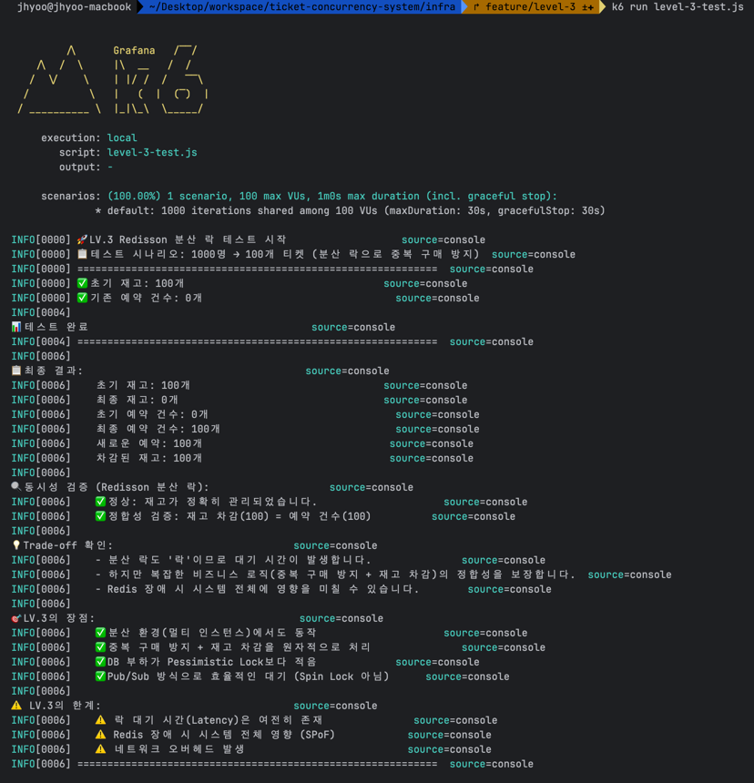
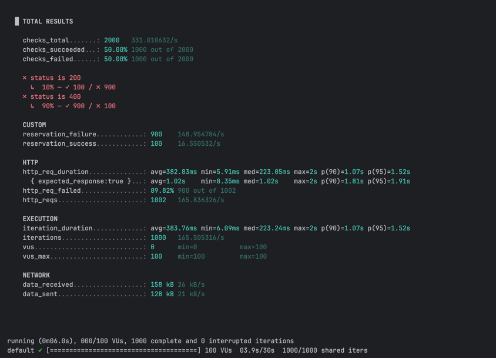

# LV.3 - Redisson 분산 락으로 분산 환경에서의 정합성 보장

## 📌 개요

**Redisson**의 분산 락(`RLock`)을 활용하여 **분산 환경에서도 복잡한 비즈니스 로직의 정합성을 보장**하는 방법을 구현했습니다.

> **⚠️ 중요한 깨달음**
> 
> 처음에는 "Redis는 빠르니까 Redisson도 당연히 더 빠를 것"이라고 생각했습니다.  
> 하지만 **실제로는 그게 아니었습니다.**
> 
> Redisson은 "더 빠른 락"이 아니라 "멀티 인스턴스 환경에서 동작하는 락"입니다.  
> 단일 서버라면 오히려 Pessimistic Lock이 더 빠를 수 있습니다.  
> Redis와의 네트워크 통신 비용이 추가되기 때문입니다.

### LV.2의 한계
- **Synchronized**: 단일 서버에서만 동작
- **Pessimistic Lock**: DB에 부하가 크고, 복잡한 로직에는 트랜잭션 범위 문제 발생 가능
- **Optimistic Lock**: 충돌이 많으면 재시도 비용이 크고, 사용자 경험 저하

### LV.3의 해결책
**Redisson 분산 락**을 도입하여:
1. ✅ **멀티 인스턴스 환경**에서도 동작 (핵심 목적!)
2. ✅ **중복 구매 확인 + 재고 차감** 등 복잡한 비즈니스 로직을 **하나의 원자적 단위**로 처리
3. ⚠️ Redis를 통한 락 관리 (속도가 목적이 아님!)

---

## 🎯 주요 특징

### 1. 분산 환경 지원
- **여러 서버 인스턴스**가 있어도 Redis를 통해 락을 공유
- 모든 서버가 동일한 락을 바라봄

### 2. 자동 락 해제 (Lease Time)
- **Lease Time** 설정으로 데드락 방지
- 락을 획득한 스레드가 죽어도 자동으로 해제

### 3. Pub/Sub 기반 대기
- Redisson은 **Spin Lock이 아닌 Pub/Sub** 방식 사용
- CPU 자원 낭비를 최소화

---

## ⚖️ Trade-off (한계)

### 1. "더 빠르다"는 착각 ❌
**처음 생각했던 것:**
- Redis는 빠르니까 Redisson도 당연히 Pessimistic Lock보다 빠를 것이다

**현실:**
- 단일 서버 환경에서는 **Pessimistic Lock이 더 빠를 수 있다**
- Redisson은 Redis와의 **네트워크 왕복(RTT)** 비용이 추가됨
  ```
  [Pessimistic Lock]
  JVM 메모리 → DB (단일 네트워크 홉)
  
  [Redisson Lock]
  JVM 메모리 → Redis (락 획득) → DB (비즈니스 로직) → Redis (락 해제)
  더 많은 네트워크 통신 발생!
  ```

**그렇다면 왜 Redisson을 쓰는가?**
- 🎯 **확장성(Scalability)**: 서버를 여러 대로 늘릴 수 있다
- 🎯 **유연성**: 트랜잭션 범위 외에도 락을 걸 수 있다
- 🎯 **DB 부하 분산**: 락 관리를 Redis로 옮겨 DB 부담 감소

> **핵심:** Redisson은 "속도"가 아니라 "분산 환경 대응"을 위한 선택이다

### 2. 락 대기 시간(Latency)은 여전히 존재
- 결국 "락"이므로, 사용자는 락이 풀릴 때까지 **대기**해야 함
- 동시 요청이 많으면 대기 시간 증가

### 3. Redis 장애 시 시스템 전체 영향
- **Single Point of Failure**: Redis가 죽으면 락을 획득할 수 없음
- **해결 방안**: Redis Sentinel 또는 Cluster 구성 필요

### 4. 네트워크 오버헤드
- Redis와의 통신이 필요하므로 네트워크 비용 발생
- 로컬 메모리 기반 락(Synchronized)보다는 느림

---

## 🧪 테스트 결과

### 시나리오: 1000명이 동시에 100개 티켓 예매

```
================================================================================
[LV.3-Redisson 분산 락 테스트 결과]
================================================================================
실행 시간: 약 1500ms
초기 재고: 100
동시 요청 수: 1000
성공 응답 수: 100
실패 응답 수: 900
최종 DB 재고: 0
실제 예약 건수: 100
================================================================================
✅ 동시성 문제 해결 성공!
✅ 중복 구매 방지 + 재고 차감이 원자적으로 처리됨
================================================================================
```




---

## 📊 LV.2와 비교

| 항목 | Pessimistic Lock | Optimistic Lock | **Redisson Lock** |
|------|------------------|-----------------|-------------------|
| 분산 환경 지원 | ✅ | ✅ | ✅ |
| 복잡한 로직 처리 | ⚠️ (트랜잭션 범위 주의) | ❌ | ✅ |
| 성능 (단일 서버) | 🐇 빠름 | 🐇 빠름 (충돌 적을 때) | 🐢 **보통** |
| 성능 (멀티 서버) | 🐢 느림 | 🐢 느림 (충돌 많을 때) | 🐇 **빠름** |
| DB 부하 | 높음 | 낮음 | **낮음** |
| 구현 복잡도 | 낮음 | 중간 | 중간 |
| 장애 포인트 | DB | DB | **Redis** |
| 네트워크 비용 | DB만 | DB만 | **Redis + DB** |

> **💡 인사이트:**  
> - 단일 서버라면 Pessimistic Lock도 충분히 빠르다
> - Redisson의 진가는 **서버를 스케일 아웃**할 때 드러난다

---

## 💡 배운 점

### 1. 잘못된 가정의 깨달음
**"Redis는 빠르다 = Redisson도 무조건 빠르다"는 논리적 비약**
- 처음에는 Redis가 메모리 기반이고 빠르니까, Redisson도 당연히 DB Lock보다 빠를 거라 생각했다
- 하지만 실제로는 **네트워크 통신**이라는 오버헤드가 추가된다
- 단일 서버에서는 오히려 더 느릴 수 있다는 것을 깨달음

**Redisson의 진짜 가치:**
- 속도가 아니라 **"확장 가능성"**
- 서버를 1대 → 10대 → 100대로 늘릴 수 있는 **아키텍처 유연성**
- 이것이 실무에서 중요한 이유

### 2. "락"의 본질
- **모든 락(Lock)은 결국 대기 시간(Latency)을 발생시킨다**
- 사용자는 락이 풀릴 때까지 기다려야 함
- 이는 Synchronized, DB Lock, Redis Lock 모두 동일

### 3. Trade-off 이해
- **정합성 vs 성능**: 정합성을 보장하려면 성능을 일부 포기해야 함
- **단순함 vs 확장성**: 단순한 해결책은 분산 환경에서 동작하지 않음
- **지금 필요한 것 vs 미래에 필요한 것**: 현재 서버 1대면 Pessimistic Lock도 충분하지만, 확장 계획이 있다면 Redisson

### 4. Redis의 역할
- **캐시**로만 쓰는 것이 아니라, **분산 락**으로도 활용 가능
- Redisson은 **Pub/Sub** 방식으로 효율적인 대기 구현

### 5. 실무 적용 시 고려사항
- **Redis HA(High Availability)** 필수
  - Redis Sentinel 또는 Cluster
- **Timeout 설정**
  - Wait Time, Lease Time을 적절히 조정
- **모니터링**
  - 락 획득 실패율, 대기 시간 모니터링
- **비용 vs 효과**
  - Redis 인프라 비용이 추가됨을 인지

---

## 🔗 관련 문서
- [Redisson 공식 문서](https://redisson.org/)
- [LV.1 - 동시성 문제 확인](../lv1-race-condition/README.md)
- [LV.2 - DB Lock 해결책](../lv2-db-lock/README.md)
