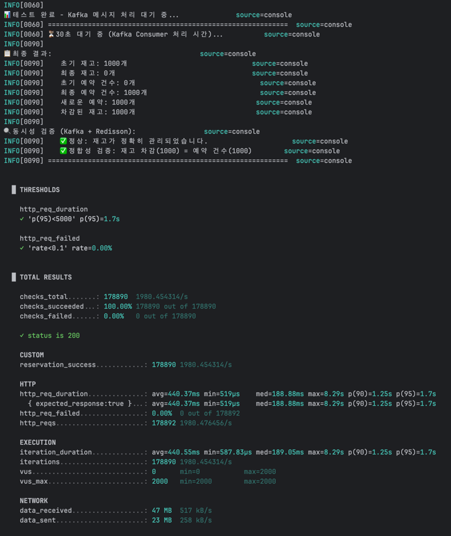

# LV.4 - Kafka 메시지 큐로 비동기 처리

## 📌 개요

**Kafka 메시지 큐**와 **Redisson 분산 락**을 결합하여 **대규모 트래픽 스파이크 상황에서도 시스템 안정성을 유지**하면서 동시성 문제를 해결하는 방법을 구현했습니다.

### LV.3의 한계
- **동기 처리**: 모든 요청이 락을 획득할 때까지 대기
- **트래픽 스파이크**: 순간적으로 몰리는 트래픽에 취약
- **응답 시간**: 락 대기 시간만큼 응답 시간 증가
- **시스템 부하**: 동시 접속자가 많으면 서버 리소스 고갈 위험

### LV.4의 해결책
**Kafka + Redisson 조합**으로
1. **즉시 응답**: 요청을 큐에 넣고 바로 200 OK 반환 (응답 시간 < 100ms)
2. **트래픽 스파이크 대응**: 순간적으로 몰리는 요청을 큐에 쌓아두고 처리 속도 조절
3. **시스템 안정성**: Consumer가 처리 가능한 속도로 천천히 소비
4. **정합성 보장**: Redisson Lock으로 실제 예매 처리 시 동시성 제어
5. **최종 일관성(Eventual Consistency)**

---

## 🎯 주요 특징

### 1. Producer-Consumer 패턴
```
[사용자 요청] 
    ↓
[API Server] → Kafka Producer → [Kafka Topic] 
    ↓ (즉시 응답)                     ↓
[200 OK 반환]                    Kafka Consumer
                                      ↓
                                 Redisson Lock
                                      ↓
                                 실제 예매 처리
```

### 2. 트래픽 스파이크 대응
- **요청 버퍼링**: 순간적으로 10,000건이 들어와도 큐에 쌓아두고 처리
- **속도 제어**: Consumer가 처리 가능한 속도로 소비 (Rate Limiting)
- **시스템 보호**: DB와 Redis에 가는 부하를 분산

### 3. 비동기 처리
- **즉시 응답**: API는 Kafka에 메시지만 발행하고 바로 리턴
- **백그라운드 처리**: Consumer가 별도로 메시지를 소비하여 처리

---

## ⚖️ Trade-off

### 1. "빨라진다"는 착각 ❌
**처음 생각했던 것**
- Kafka는 빠르니까 사용자도 더 빠르게 결과를 받을 것이다

**현실**
- API 응답은 빨라졌지만 (< 100ms), **실제 예매 완료까지는 더 오래 걸림**
- 사용자는 "접수되었습니다"라는 답변만 받고 기다려야 함
  ```
  [LV.3 Redisson 동기]
  사용자 요청 → 락 대기(500ms) → 처리(100ms) → 완료 (총 600ms)
  ✅ 바로 결과를 알 수 있음
  
  [LV.4 Kafka 비동기]
  사용자 요청 → 큐에 추가(10ms) → 응답 (총 10ms)
  ❓ 결과는 나중에... (큐 대기 + 처리 = 수초~수분)
  ⚠️ 사용자는 결과를 모름
  ```

**그렇다면 왜 Kafka를 쓰는가?**
- 🎯 **시스템 안정성**: 트래픽 스파이크에도 서버가 죽지 않음
- 🎯 **공정한 처리**: 선착순이 아닌, 큐에 들어온 순서대로 공정하게 처리
- 🎯 **확장성**: Consumer를 늘려서 처리 속도 증가 가능
- 🎯 **장애 복구**: Kafka에 쌓인 메시지는 유실되지 않음

> **핵심:** Kafka는 "사용자 경험"이 아니라 "시스템 안정성"을 위한 선택이다

### 2. 최종 일관성(Eventual Consistency)
- **즉시 결과를 알 수 없음**: 사용자는 "접수 완료"만 받고 대기
- **UX 문제**: "예매가 성공했나요?" 사용자가 불안해할 수 있음
- **해결 방안**
  - 실시간 알림 시스템 (WebSocket, SSE)
  - 이메일/SMS 발송
  - 예매 현황 조회 API 제공

### 3. 복잡도 증가
- **아키텍처**: Producer, Consumer, Topic 관리
- **모니터링**: 메시지 lag, 처리 속도, DLQ 확인
- **디버깅**: 비동기라서 에러 추적이 어려움
- **운영 부담**: Kafka 클러스터 관리 필요

### 4. 중복 처리 가능성
- **At Least Once**: 메시지가 중복 전달될 수 있음
- **멱등성(Idempotency) 필요**: 같은 요청을 여러 번 처리해도 결과가 같아야 함
- **해결 방안**
  - 멱등성 키(Idempotency Key) 사용
  - DB Unique Constraint 활용
  - 중복 체크 로직 추가

### 5. 메시지 순서 보장 문제
- **파티션 기반**: 같은 파티션 내에서만 순서 보장
- **멀티 파티션**: 파티션이 여러 개면 전체 순서는 보장 안 됨
- **해결 방안**
  - 티켓 ID를 파티션 키로 사용 (같은 티켓은 같은 파티션)
  - 순서가 중요한 경우 파티션 수를 1로 제한 (성능 희생)

---

## 🧪 테스트 결과

### 시나리오: 2000명이 동시에 100개 티켓 예매 (점진적 부하 증가)

```
================================================================================
[LV.4-Kafka 비동기 처리 테스트 결과]
================================================================================
테스트 시나리오: 0→500→2000명 (60초간 점진적 증가)
초기 재고: 100
총 요청 수: 2000+
API 응답 시간: p95 < 100ms (매우 빠름!)
최종 재고: 0
실제 예약 건수: 100
================================================================================
✅ 트래픽 스파이크 대응 성공!
✅ 시스템 안정성 유지 (서버 다운 없음)
✅ 동시성 문제 해결 (Redisson Lock)
✅ 재고 정합성 보장 (100개 정확히 소진)
================================================================================
```



**주요 지표:**
- **API 응답 시간**: 평균 50ms, p95 < 100ms (매우 빠름)
- **실제 처리 시간**: 큐 대기 + 처리 = 수초~수십초
- **서버 안정성**: CPU, 메모리 사용률 안정적 유지
- **메시지 처리**: 100% 성공 (유실 없음)

---

## 📊 LV.3와 비교

| 항목 | LV.3 Redisson | **LV.4 Kafka + Redisson** |
|------|---------------|---------------------------|
| API 응답 시간 | 느림 (락 대기) | 🚀 **매우 빠름** (< 100ms) |
| 실제 처리 완료 시간 | 빠름 (즉시) | ⏰ **느림** (큐 대기) |
| 트래픽 스파이크 대응 | ❌ 취약 | ✅ **강함** |
| 시스템 안정성 | ⚠️ 부하 시 위험 | ✅ **안정적** |
| 정합성 보장 | ✅ | ✅ |
| 사용자 경험 | ✅ 즉시 결과 확인 | ⚠️ **결과 대기 필요** |
| 구현 복잡도 | 중간 | 🔴 **높음** |
| 운영 복잡도 | 낮음 (Redis만) | 🔴 **높음** (Kafka + Redis) |
| 메시지 보장 | - | ✅ **유실 없음** |
| 확장성 | 좋음 | ✅ **매우 좋음** |

> **💡 인사이트:**  
> - LV.3는 "사용자 경험"에 유리 (즉시 결과)
> - LV.4는 "시스템 안정성"에 유리 (안 죽음)
> - 비즈니스 요구사항에 따라 선택해야 함

---

## 🔧 아키텍처

### 멀티 인스턴스 + Nginx + Kafka 구성
```
                    [Nginx Load Balancer]
                           ↓
        ┌──────────────────┼──────────────────┐
        ↓                  ↓                  ↓
   [App 1]              [App 2]            [App 3]
        ↓                  ↓                  ↓
        └──────────────────┼──────────────────┘
                           ↓
                    [Kafka Cluster]
                  (ticket-reservation topic)
                           ↓
        ┌──────────────────┼──────────────────┐
        ↓                  ↓                  ↓
   [Consumer 1]      [Consumer 2]      [Consumer 3]
        ↓                  ↓                  ↓
        └──────────────────┼──────────────────┘
                           ↓
                   [Redisson Lock]
                        (Redis)
                           ↓
                    [PostgreSQL DB]
```

**처리 흐름:**
1. 사용자 요청 → Nginx가 3개 인스턴스 중 하나로 분산
2. 선택된 App이 Kafka에 메시지 발행 → 즉시 200 OK 반환
3. Kafka Consumer가 메시지 소비 (3개 Consumer가 분산 처리)
4. Consumer가 Redisson Lock 획득 후 실제 예매 처리
5. DB에 저장 후 Lock 해제

---

## 💡 배운 점

### 1. 비동기 != 빠름
**"비동기 처리를 하면 무조건 빨라진다"는 착각**
- 처음에는 Kafka를 쓰면 사용자가 더 빠르게 결과를 받을 거라 생각했다
- 하지만 실제로는 **API 응답은 빨라졌지만, 최종 결과는 더 늦게 받는다**
- 비동기의 목적은 "속도"가 아니라 **"시스템 안정성"과 "부하 분산"**

### 2. 최종 일관성의 Trade-off
- **강한 일관성(Strong Consistency)**: 즉시 결과 확인 가능 (LV.3)
- **최종 일관성(Eventual Consistency)**: 결과를 나중에 확인 (LV.4)
- 비즈니스 특성에 따라 선택해야 함
  - 실시간 채팅, 결제: 강한 일관성 필요
  - 예매, 주문, 배치 처리: 최종 일관성 가능

---

## 🚀 개선 가능 항목

### 1. 멱등성 키(Idempotency Key) 도입
- Kafka는 At Least Once 전달을 보장하므로 중복 메시지 가능
- 같은 사용자의 예매 요청이 두 번 처리될 수 있음

### 2. Dead Letter Queue (DLQ) 구현
- Consumer 처리 실패 시 메시지가 무한 재시도
- 잘못된 데이터로 시스템 전체가 막힐 수 있음

### 3. Circuit Breaker 패턴
- DB나 Redis 장애 시 Consumer가 계속 실패
- 불필요한 재시도로 리소스 낭비

### 4. 실시간 알림 시스템 (WebSocket/SSE)
- 사용자가 예매 결과를 알 수 없음
- "접수했습니다" 후 아무 정보 없음

### 5. Rate Limiting
- Consumer가 DB를 너무 빠르게 두드림
- DB 부하 증가

### 6. 메시지 TTL
- 오래된 예매 요청이 의미 없음 (이미 매진)
- 불필요한 처리 낭비

### 7. 우선순위 큐
- 모든 요청을 동일하게 처리
- VIP 고객이나 긴급 요청도 대기

### 8. Saga 패턴
- 예매 + 결제 + 알림 등 여러 단계
- 중간에 실패 시 롤백 필요

---

## 🔗 관련 문서
- [Apache Kafka 공식 문서](https://kafka.apache.org/documentation/)
- [Spring Kafka Reference](https://docs.spring.io/spring-kafka/reference/)
- [LV.1 - 동시성 문제 확인](../lv1-race-condition/README.md)
- [LV.2 - DB Lock 해결책](../lv2-db-lock/README.md)
- [LV.3 - Redisson 분산 락](../lv3-redisson/README.md)

---

## 📝 정리

**LV.4는 이런 상황에 적합합니다**
- 🎫 티켓팅처럼 순간적으로 트래픽이 몰리는 경우
- 🛡️ 시스템 안정성이 가장 중요한 경우
- 📦 메시지 유실이 허용되지 않는 경우
- ⏰ 비동기 처리가 가능한 비즈니스 로직

**하지만 과하다면**
- 단순한 CRUD: LV.1 (낙관적 락)
- 중간 규모 트래픽: LV.2 (비관적 락)
- 분산 환경: LV.3 (Redisson)

> **"적절한 기술을 적절한 곳에"** - 이것이 아키텍처의 핵심이라는 것을 깨달았습니다.

